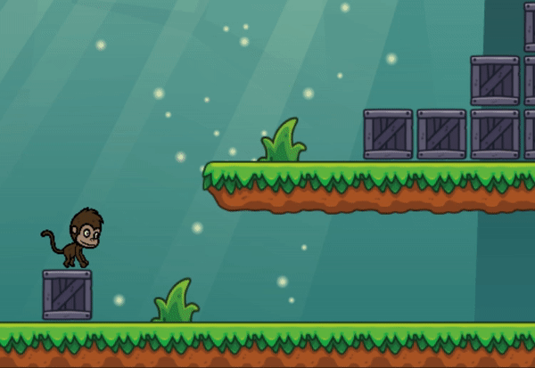
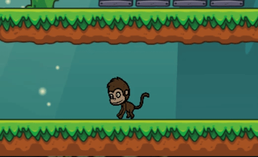

# Banana Dash

###### A simple platform jumping game where the user plays as a monkey character. The player is given the challenge of collecting bananas in each level. Only once the player collects all the bananas will he/she move onto the next level

# Live link

<a href='https://lawrence14701.github.io/Banana-Dash/'>Click here to go to live version of Banana Dash</a>

# Technologies and languages used
* JS
* Canvas html5
* webpack
* CSS3


# Functionality and MVPs

* intro screen/game over screen
* audio for collecting bananas
* sprite animations
* collision detection 


# Collision Detection Algo

<!-- blank line -->

<!-- blank line -->


###### The purpose of this function is to iterate through every platform in the canvas while simultaneously checking the player's X and Y coordinates and determining whether it equals the X or Y coordinate of the platform. It was important for me to take into consideration the width and height of the platform and player. When a collision happens, the players X and Y coordinates are adjusted accordingly through the offset variable.

```javascript
export function collisionCheck(character, platform) {
  //vector represents the distance between the character and the platform
  var vectorX =
    character.x + character.width / 2 - (platform.x + platform.width / 2);
  var vectorY =
    character.y + character.height / 2 - (platform.y + platform.height / 2);
    //taking half the width of both the platform and the character
  var halfWidths = character.width / 2 + platform.width / 2;
  var halfHeights = character.height / 2 + platform.height / 2;

  var collisionDirection = null;

  //if the character touches a platform 
  if (Math.abs(vectorX) < halfWidths && Math.abs(vectorY) < halfHeights) {
    var offsetX = halfWidths - Math.abs(vectorX);
    var offsetY = halfHeights - Math.abs(vectorY);
    if (offsetX < offsetY) {
      if (vectorX > 0) {
        collisionDirection = "left";
        character.x += offsetX; //offset prevents the player from moving within the boundaries set by the platform
      } else {
        collisionDirection = "right";
        character.x -= offsetX;
      }
    } else {
      if (vectorY > 0) {
        collisionDirection = "top";
        character.y += offsetY;
      } else {
        collisionDirection = "bottom";
        character.y -= offsetY;
      }
    }
  }

  return collisionDirection;
}
```


# Player animations

<!-- blank line -->

<!-- blank line -->


###### Inside the player animation logic I iterated through my sprite images based by comparing the loop time to the last time the sprite has rendered

```javascript
 if (!this.timeWhenLastUpdate) {
      //initial picture that we render (starting point)
      this.timeWhenLastUpdate = this.startTime - this.timePerIdleFrame;
    }
    this.timeFromLastUpdate = this.startTime - this.timeWhenLastUpdate;
    //checking when time in between animation frame is greater than timeperframe
    if (this.timeFromLastUpdate > this.timePerIdleFrame) {
      this.monkey = document.getElementById("idle_" + this.frameNumberIdle);
      this.timeWhenLastUpdate = this.startTime;
      if (this.frameNumberIdle < this.numberOfIdleImages - 1) {
        this.frameNumberIdle++;
      } else {
        this.frameNumberIdle = 0;
      }
    }
  }
```


